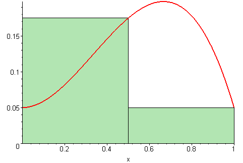

# Riemann Summation (Integration)

+ [MathPKG](../README.md)
    + [Installation](../README.md#installation)
    + [Documentation](./README.md)
        + [Complex Numbers](./Complex.md)
        + [Functions](./Functions.md)
        + [**Riemann Summation (Integration)**](#riemann-summation-integration)
            + [left(a, b, f[, n = 0])](#lefta-b-f-n--0-l--10---3)
            + [right(a, b, f[, n = 0])](#righta-b-f-n--0-l--10---3)
            + [avg(a, b, f[, n = 0])](#avga-b-f-n--0-l--10---3)
            + [complexLeft(a, b, f[, n = 0])](#complexlefta-b-f-n--0-l--10---3)
            + [complexRight(a, b, f[, n = 0])](#complexrighta-b-f-n--0-l--10---3)
            + [complexAvg(a, b, f[, n = 0])](#complexavga-b-f-n--0-l--10---3)
        + [BaseToolbox](./BaseToolbox.md)
        + [Constants](./Constants.md)

MathPKG has no capability of finding antiderivatives of a function, so to integrate, one may use MathPKG to calculate the area under a curve using Riemann Summation.
The Riemann Summation functions are located inside ``MathPKG.RiemannSum``. For convenience, one may define:
```
const {RiemannSum} = MathPKG;
```

## left(a, b, f[, n = 0, l = 10 ^ -3])


Calculates the left side Riemann sum of `f(x)` from `x=a` to `x=b`. In the geometric sense, `n` is the number of "rectangles", the bigger `n` is, the more accurate the calculation will be. If `n = 0`, the function sets `n` so that the length of one rectangle on the x-axis is `l`. By default, `n` is `0` and `l` is `10 ^ -3`, making the calculation extremly accurate. The left side sum is usually a little bit less than the actual area.
```
let area = RiemannSum.left(0,10,x=>x); // = 49.995000000000005
```

## right(a, b, f[, n = 0, l = 10 ^ -3])



Calculates the right side Riemann sum of `f(x)` from `x=a` to `x=b`. In the geometric sense, `n` is the number of "rectangles", the bigger `n` is, the more accurate the calculation will be. If `n = 0`, the function sets `n` so that the length of one rectangle on the x-axis is `l`. By default, `n` is `0` and `l` is `10 ^ -3`, making the calculation extremly accurate. The right side sum is usually a little bit more than the actual area.
```
let area = RiemannSum.right(0,10,x=>x); // = 50.005
```

## avg(a, b, f[, n = 0, l = 10 ^ -3])
Calculates the average of the left side and right side Riemann sums of `f(x)` from `x=a` to `x=b`. In the geometric sense, `n` is the number of "rectangles", the bigger `n` is, the more accurate the calculation will be. If `n = 0`, the function sets the `n` so that the length of one rectangle on the x-axis is `l`. By default, `n = 0` and `l = 10 ^ -3`, making the calculation extremly accurate. This is the most accurate method.
```
let area = RiemannSum.avg(0,10,x=>x); // = 50
```

## complexLeft(a, b, f[, n = 0, l = 10 ^ -3])

Same as ``RiemannSum.left`` except ``f`` is a function which takes a single ``Complex`` argument instead of a real one and must return an instance of ``Complex``. `a` and `b` must be real numbers.

## complexRight(a, b, f[, n = 0, l = 10 ^ -3])

Same as ``RiemannSum.right`` except ``f`` is a function which takes a single ``Complex`` argument instead of a real one and must return an instance of ``Complex``. `a` and `b` must be real numbers.

## complexAvg(a, b, f[, n = 0, l = 10 ^ -3])

Same as ``RiemannSum.avg`` except ``f`` is a function which takes a single ``Complex`` argument instead of a real one and must return an instance of ``Complex``. `a` and `b` must be real numbers.